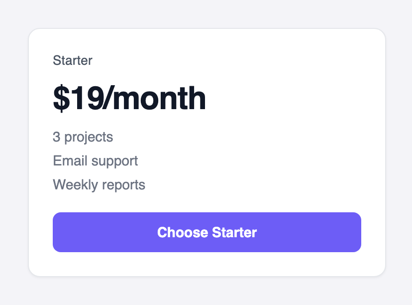
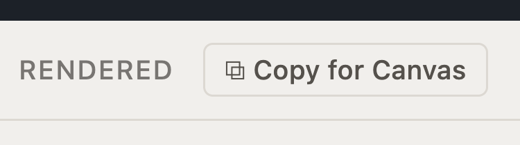

Design the interfaces your Agents speak through. UI on unoverse is **data, not code**: a component is a JSON definition, rendered natively on every platform by the SDK. No React, no CSS, no rebuild.

This challenge is a build, not a theory tour:

| | |
| --- | --- |
| **What you'll build** | Your org and its theme, plus a price card component your Agent can stream data into |
| **Where it lives** | `apps/unoverse/rx/orgs/<your-org>/components/pricecard/` |
| **Where you'll see it** | Live in **Studio** while you design; in the conversation once wired to a workflow |

This approach is called **SDUI**, server-driven UI. The interface is served as data, and each channel's native SDK renders it. One definition renders on your website, in your mobile apps, and on every channel you connect; publish a change and it is live on all of them at once, with no release cycle. [This introduction to SDUI](https://medium.com/digia-studio/server-driven-ui-sdui-the-necessary-evil-for-scalable-mobile-apps-80c650a2c8de) covers the pattern and why it scales; [SDUI and MCP Apps](../design/02-sdui-and-mcp-apps.md) explains how it works here.

Definitions are composed from a [small closed set of primitives](../design/02-sdui-and-mcp-apps.md#the-closed-primitive-set), and every visual value is a token name resolved by the theme. That's all the theory this page needs; the **Design** tab of these docs is the full journey, from [Quick Start](../design/01-quick-start.md) through components, state, templates, and tokens.

<Note>
**MCP Apps are the future, and you are designing for it now.** [MCP Apps](https://modelcontextprotocol.io/extensions/apps/overview) are interactive apps that run inside AI clients like ChatGPT and Claude. unoverse is native MCP, so every interface you design here is served as an MCP app. As new channels adopt the standard, your designs already work there.
</Note>

## Build it

<Steps>
<Step title="Open Studio">

**Studio** runs with the platform at http://localhost:3002. Open **Components**: every definition renders from its prop defaults, and the controls walk its layouts and states. This is where you'll live while designing.

</Step>
<Step title="Create your org">

Your own work lives in your org: its components, its apps, its brand. One command sets it up:

```bash Create your org
unoverse new org acme
```

You get `rx/orgs/acme/` with `components/`, `templates/`, and a complete copy of the default token set in `styles/`, self-contained and ready to rebrand.

</Step>
<Step title="Make your theme">

The first design work in a new org is the brand. It lives in `rx/orgs/acme/styles/`:

| Folder | What you set there |
| --- | --- |
| `base/` | The raw scales: color palettes, typography and fonts, spacing, radius |
| `semantic/` | The names components use, mapped onto your scales |
| `themes/` | `light` and `dark`: the values each theme resolves to |

Start with `base/color.json` and `base/typography.json`: your palette and your fonts. In **Studio**, switch to your org and change a value. Every component re-renders in your brand, live, with no build step. That loop, edit JSON and watch it render, is the whole design workflow.

Change token values freely; keep every token name, and the theme contract stays green.

</Step>
<Step title="Create your own component">

Author your component in your org, at `rx/orgs/acme/components/pricecard/pricecard.json`. Here is a complete simple price card, and what it renders:

<Tabs>
<Tab title="Definition">

```json rx/orgs/acme/components/pricecard/pricecard.json
{
  "unoverse": "1.0",
  "kind": "component",
  "name": "PriceCard",
  "category": "General",
  "nodeSize": { "width": 360, "height": 320 },
  "description": "A pricing card: plan name, price, feature list, and a call to action.",
  "whenToUse": "Present ONE plan or offer with its price and what it includes. Pick for a single purchasable option, not for comparing metrics or listing content.",
  "props": {
    "title": { "type": "string", "default": "Starter", "input": true },
    "price": { "type": "string", "default": "$19/month", "input": true },
    "features": {
      "type": "array",
      "default": [
        { "label": "3 projects" },
        { "label": "Email support" },
        { "label": "Weekly reports" }
      ],
      "input": true
    }
  },
  "root": {
    "type": "Box",
    "style": {
      "width": "full",
      "direction": "column",
      "gap": "3",
      "padding": "6",
      "background": "surface.base",
      "border": "subtle",
      "radius": "lg",
      "shadow": "sm"
    },
    "children": [
      {
        "type": "Text",
        "bind": { "value": "title" },
        "style": { "font": "label", "weight": "medium", "color": "text.secondary" }
      },
      {
        "type": "Text",
        "bind": { "value": "price" },
        "style": { "font": "headline.lg", "weight": "semibold", "color": "text.primary" }
      },
      {
        "type": "Each",
        "bind": { "items": "features" },
        "style": { "direction": "column", "gap": "2" },
        "template": {
          "type": "Text",
          "bind": { "value": "label" },
          "style": { "font": "body.sm", "color": "text.tertiary" }
        }
      },
      { "type": "Ref", "ref": "button", "with": { "label": "Choose Starter" } }
    ]
  }
}
```

</Tab>
<Tab title="Rendered">



</Tab>
<Tab title="Data">

A workflow fills the card by sending an object whose keys match the `props`, by name:

```json Data a workflow streams in
{
  "title": "Pro",
  "price": "$49/month",
  "features": [
    { "label": "Unlimited projects" },
    { "label": "Priority support" },
    { "label": "Daily reports" }
  ]
}
```

</Tab>
</Tabs>

Reading it top to bottom:

- The envelope names the component and carries `whenToUse`, how Agents discover it.
- `props` declares every field a workflow can fill, each with a realistic `default`. The defaults are exactly what **Studio** renders in mock mode. `input: true` marks the field as workflow-fed.
- `root` composes the layout from the closed primitives: a `Box`, two bound `Text` elements, an `Each` over the features, and the shared button atom via `Ref`.
- Every style value is a token name. No pixels, no hex.

</Step>
<Step title="Lint it">

```bash Check your definition
unoverse lint
```

The linter enforces the design rules with doc-cited messages: token names only (no raw px or hex), every bound field declared in `props`, one home for every piece of state. **Studio** and the platform apply the same rules, so a clean lint means it ships.

</Step>
<Step title="Put it in a workflow">

New components register as nodes at boot, and a build restarts the platform:

```bash Load the new node
unoverse build
```

Your component now travels from **Studio** to **Canvas** by copy and paste:

1. In **Studio**, open **PriceCard** under **Components**.
2. Click **Copy for Canvas**. The component is copied to your clipboard as a canvas node.



3. In **Canvas**, open your workflow and paste with **Cmd+V**. The node lands on the canvas, sized to the card.
4. Double-click it and fill its fields, the same `title`, `price`, and `features` you saw in the Data tab, from upstream signals or literals.

Step through the workflow and the card renders live in the conversation, in your org's theme.

</Step>
</Steps>

<Note>
Restarts are only for **new** components, because the platform synthesizes a node per definition at boot. Edits to existing components apply live.
</Note>

## How far this goes

A price card is the small end. Components carry **states and layouts**: a component can be a wizard that walks through steps, a card that expands into a full-screen focus view, or a product finder with its own private flow. Templates go further and become **full microapps**, MCP Apps with their own layouts, states, and workflow bindings, discovered and opened by Agents in conversation.

Application state is managed for you. Every component owns its own state, templates react to it, and the platform holds one shared state across the whole conversation, so views, panels, and flows stay in sync with no state library to wire. The [Design](../design/01-quick-start.md) section covers all of it: components, [state](../design/04-state.md), templates, and tokens.

## Have Claude Code build it

<div className="skill-callout">

<div className="skill-eyebrow">Claude Code skill · ships with your repo</div>
<div className="skill-title">/unoverse-create</div>

The same skill that builds nodes designs components. Open your repo in Claude Code and describe what you want:

> Create a pricing card component with a title, three feature lines, and a call to action.

The skill follows the authoring rules, builds the definition in layers, lints it, and walks the deploy loop, so what it produces passes the same checks your own work does.

</div>

## Next steps

<Card title="The Design journey" icon="palette" href="../design/01-quick-start.md" horizontal>
Components, state, templates, and tokens, in full depth.
</Card>

<Card title="Create an MCP" icon="plug" href="./06-create-a-mcp.md" horizontal>
Expose your Agent to ChatGPT and every MCP client.
</Card>
